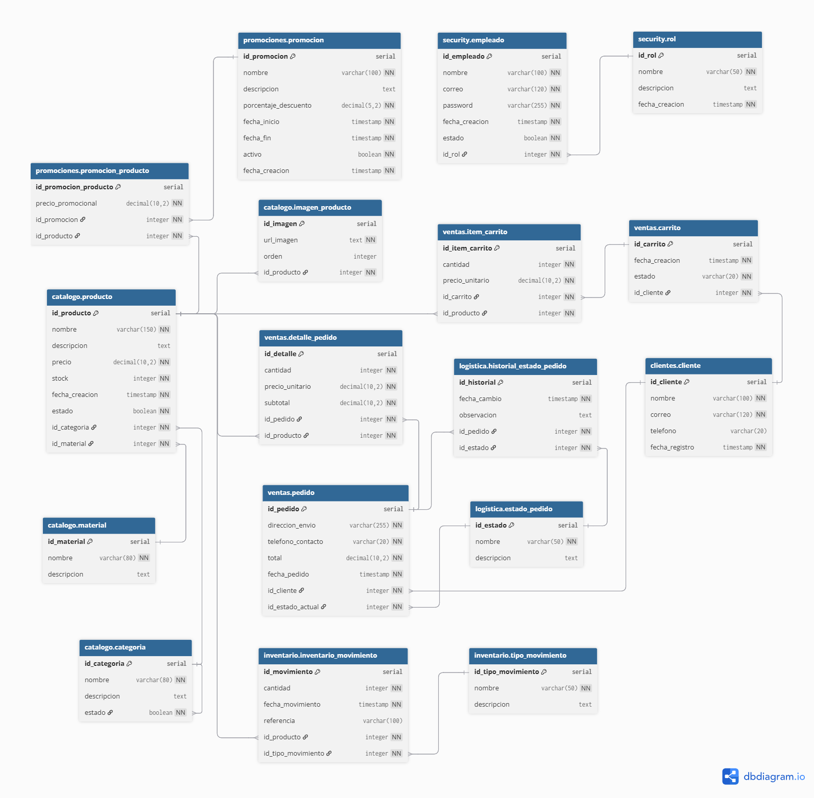

# Diagrama MER - Base de Datos accesorios-dm-database

## Entidades y Atributos

### 1. ROL (security.rol)
| Atributo | Tipo | Restricción | Descripción |
|----------|------|-------------|-------------|
| id_rol | SERIAL | PRIMARY KEY | Identificador único del rol |
| nombre | VARCHAR(50) | NOT NULL, UNIQUE | Nombre del rol (ADMIN, VENDEDOR, BODEGUERO, CLIENTE) |
| descripcion | TEXT | | Descripción del rol |
| fecha_creacion | TIMESTAMP | NOT NULL, DEFAULT CURRENT_TIMESTAMP | Fecha de creación |

### 2. EMPLEADO (security.empleado)
| Atributo | Tipo | Restricción | Descripción |
|----------|------|-------------|-------------|
| id_empleado | SERIAL | PRIMARY KEY | Identificador único del empleado |
| nombre | VARCHAR(100) | NOT NULL | Nombre completo |
| correo | VARCHAR(120) | NOT NULL, UNIQUE | Correo electrónico (login) |
| password | VARCHAR(255) | NOT NULL | Contraseña encriptada |
| fecha_creacion | TIMESTAMP | NOT NULL, DEFAULT CURRENT_TIMESTAMP | Fecha de registro |
| estado | BOOLEAN | NOT NULL, DEFAULT TRUE | Activo/Inactivo |
| id_rol | INTEGER | NOT NULL, FOREIGN KEY (security.rol) | Rol del empleado |

### 3. CLIENTE (clientes.cliente)
| Atributo | Tipo | Restricción | Descripción |
|----------|------|-------------|-------------|
| id_cliente | SERIAL | PRIMARY KEY | Identificador único del cliente |
| nombre | VARCHAR(100) | NOT NULL | Nombre completo |
| correo | VARCHAR(120) | NOT NULL, UNIQUE | Correo electrónico |
| telefono | VARCHAR(20) | | Número de teléfono |
| fecha_registro | TIMESTAMP | NOT NULL, DEFAULT CURRENT_TIMESTAMP | Fecha de registro |

### 4. CATEGORIA (catalogo.categoria)
| Atributo | Tipo | Restricción | Descripción |
|----------|------|-------------|-------------|
| id_categoria | SERIAL | PRIMARY KEY | Identificador único de la categoría |
| nombre | VARCHAR(80) | NOT NULL, UNIQUE | Nombre de la categoría |
| descripcion | TEXT | | Descripción |
| estado | BOOLEAN | NOT NULL, DEFAULT TRUE | Activo/Inactivo |

### 5. MATERIAL (catalogo.material)
| Atributo | Tipo | Restricción | Descripción |
|----------|------|-------------|-------------|
| id_material | SERIAL | PRIMARY KEY | Identificador único del material |
| nombre | VARCHAR(80) | NOT NULL, UNIQUE | Nombre del material |
| descripcion | TEXT | | Descripción |

### 6. PRODUCTO (catalogo.producto)
| Atributo | Tipo | Restricción | Descripción |
|----------|------|-------------|-------------|
| id_producto | SERIAL | PRIMARY KEY | Identificador único del producto |
| nombre | VARCHAR(150) | NOT NULL | Nombre del producto |
| descripcion | TEXT | | Descripción |
| precio | NUMERIC(10,2) | NOT NULL | Precio del producto |
| stock | INTEGER | NOT NULL, DEFAULT 0 | Cantidad disponible |
| fecha_creacion | TIMESTAMP | NOT NULL, DEFAULT CURRENT_TIMESTAMP | Fecha de creación |
| estado | BOOLEAN | NOT NULL, DEFAULT TRUE | Activo/Inactivo |
| id_categoria | INTEGER | NOT NULL, FOREIGN KEY (catalogo.categoria) | Categoría del producto |
| id_material | INTEGER | NOT NULL, FOREIGN KEY (catalogo.material) | Material del producto |

### 7. IMAGEN_PRODUCTO (catalogo.imagen_producto)
| Atributo | Tipo | Restricción | Descripción |
|----------|------|-------------|-------------|
| id_imagen | SERIAL | PRIMARY KEY | Identificador único de la imagen |
| url_imagen | TEXT | NOT NULL | URL de la imagen |
| orden | INTEGER | DEFAULT 1 | Orden de visualización |
| id_producto | INTEGER | NOT NULL, FOREIGN KEY (catalogo.producto) | Producto asociado |

### 8. PROMOCION (promociones.promocion)
| Atributo | Tipo | Restricción | Descripción |
|----------|------|-------------|-------------|
| id_promocion | SERIAL | PRIMARY KEY | Identificador único |
| nombre | VARCHAR(100) | NOT NULL | Nombre de la promoción |
| descripcion | TEXT | | Descripción |
| porcentaje_descuento | NUMERIC(5,2) | NOT NULL | Porcentaje de descuento |
| fecha_inicio | TIMESTAMP | NOT NULL | Inicio de la promoción |
| fecha_fin | TIMESTAMP | NOT NULL | Fin de la promoción |
| activo | BOOLEAN | NOT NULL, DEFAULT TRUE | Promoción activa |
| fecha_creacion | TIMESTAMP | NOT NULL, DEFAULT CURRENT_TIMESTAMP | Fecha de creación |

### 9. PROMOCION_PRODUCTO (promociones.promocion_producto)
| Atributo | Tipo | Restricción | Descripción |
|----------|------|-------------|-------------|
| id_promocion_producto | SERIAL | PRIMARY KEY | Identificador único de la relación |
| precio_promocional | NUMERIC(10,2) | NOT NULL | Precio con descuento |
| id_promocion | INTEGER | NOT NULL, FOREIGN KEY (promociones.promocion) | Promoción asociada |
| id_producto | INTEGER | NOT NULL, FOREIGN KEY (catalogo.producto) | Producto asociado |

### 10. CARRITO (ventas.carrito)
| Atributo | Tipo | Restricción | Descripción |
|----------|------|-------------|-------------|
| id_carrito | SERIAL | PRIMARY KEY | Identificador único |
| fecha_creacion | TIMESTAMP | NOT NULL, DEFAULT CURRENT_TIMESTAMP | Fecha de creación |
| estado | VARCHAR(20) | NOT NULL, DEFAULT 'activo', CHECK (estado IN ('activo','procesado','abandonado')) | Estado del carrito |
| id_cliente | INTEGER | NOT NULL, FOREIGN KEY (clientes.cliente) | Cliente propietario |

### 11. ITEM_CARRITO (ventas.item_carrito)
| Atributo | Tipo | Restricción | Descripción |
|----------|------|-------------|-------------|
| id_item_carrito | SERIAL | PRIMARY KEY | Identificador único |
| cantidad | INTEGER | NOT NULL, CHECK (cantidad > 0) | Cantidad del producto |
| precio_unitario | NUMERIC(10,2) | NOT NULL, CHECK (precio_unitario > 0) | Precio al momento de agregar |
| id_carrito | INTEGER | NOT NULL, FOREIGN KEY (ventas.carrito) | Carrito asociado |
| id_producto | INTEGER | NOT NULL, FOREIGN KEY (catalogo.producto) | Producto asociado |

### 12. ESTADO_PEDIDO (logistica.estado_pedido)
| Atributo | Tipo | Restricción | Descripción |
|----------|------|-------------|-------------|
| id_estado | SERIAL | PRIMARY KEY | Identificador único |
| nombre | VARCHAR(50) | NOT NULL, UNIQUE | Nombre del estado |
| descripcion | TEXT | | Descripción del estado |

### 13. PEDIDO (ventas.pedido)
| Atributo | Tipo | Restricción | Descripción |
|----------|------|-------------|-------------|
| id_pedido | SERIAL | PRIMARY KEY | Identificador único |
| direccion_envio | VARCHAR(255) | NOT NULL | Dirección de envío |
| telefono_contacto | VARCHAR(20) | NOT NULL | Teléfono de contacto |
| total | NUMERIC(10,2) | NOT NULL, CHECK (total > 0) | Monto total |
| fecha_pedido | TIMESTAMP | NOT NULL, DEFAULT CURRENT_TIMESTAMP | Fecha del pedido |
| id_cliente | INTEGER | NOT NULL, FOREIGN KEY (clientes.cliente) | Cliente que realizó el pedido |
| id_estado_actual | INTEGER | NOT NULL, FOREIGN KEY (logistica.estado_pedido) | Estado actual del pedido |

### 14. DETALLE_PEDIDO (ventas.detalle_pedido)
| Atributo | Tipo | Restricción | Descripción |
|----------|------|-------------|-------------|
| id_detalle | SERIAL | PRIMARY KEY | Identificador único |
| cantidad | INTEGER | NOT NULL, CHECK (cantidad > 0) | Cantidad del producto |
| precio_unitario | NUMERIC(10,2) | NOT NULL, CHECK (precio_unitario > 0) | Precio unitario |
| subtotal | NUMERIC(10,2) | GENERATED ALWAYS AS (cantidad * precio_unitario) STORED | Subtotal calculado |
| id_pedido | INTEGER | NOT NULL, FOREIGN KEY (ventas.pedido) | Pedido asociado |
| id_producto | INTEGER | NOT NULL, FOREIGN KEY (catalogo.producto) | Producto asociado |

### 15. HISTORIAL_ESTADO_PEDIDO (logistica.historial_estado_pedido)
| Atributo | Tipo | Restricción | Descripción |
|----------|------|-------------|-------------|
| id_historial | SERIAL | PRIMARY KEY | Identificador único |
| fecha_cambio | TIMESTAMP | NOT NULL, DEFAULT CURRENT_TIMESTAMP | Fecha del cambio |
| observacion | TEXT | | Observación del cambio |
| id_pedido | INTEGER | NOT NULL, FOREIGN KEY (ventas.pedido) | Pedido asociado |
| id_estado | INTEGER | NOT NULL, FOREIGN KEY (logistica.estado_pedido) | Nuevo estado |

### 16. TIPO_MOVIMIENTO (inventario.tipo_movimiento)
| Atributo | Tipo | Restricción | Descripción |
|----------|------|-------------|-------------|
| id_tipo_movimiento | SERIAL | PRIMARY KEY | Identificador único |
| nombre | VARCHAR(50) | NOT NULL, UNIQUE | Nombre del tipo (ENTRADA, SALIDA, AJUSTE) |
| descripcion | TEXT | | Descripción |

### 17. INVENTARIO_MOVIMIENTO (inventario.inventario_movimiento)
| Atributo | Tipo | Restricción | Descripción |
|----------|------|-------------|-------------|
| id_movimiento | SERIAL | PRIMARY KEY | Identificador único |
| cantidad | INTEGER | NOT NULL, CHECK (cantidad != 0) | Cantidad movida (positiva=entrada, negativa=salida) |
| fecha_movimiento | TIMESTAMP | NOT NULL, DEFAULT CURRENT_TIMESTAMP | Fecha del movimiento |
| referencia | VARCHAR(100) | | Referencia del movimiento |
| id_producto | INTEGER | NOT NULL, FOREIGN KEY (catalogo.producto) | Producto afectado |
| id_tipo_movimiento | INTEGER | NOT NULL, FOREIGN KEY (inventario.tipo_movimiento) | Tipo de movimiento |

---

## Relaciones entre Entidades

### Relación 1: ROL ↔ EMPLEADO
```
 ROL (1) ─────────────────────── (N) EMPLEADO
   │                                     │
   │ Un rol puede tener muchos empleados │
   │ Un empleado pertenece a un solo rol │
   └─────────────────────────────────────┘
```

### Relación 2: CLIENTE ↔ PEDIDO
```
  CLIENTE (1) ──────────────────────── (N) PEDIDO
     │                                       │
     │ Un cliente puede tener muchos pedidos │
     │ Un pedido pertenece a un solo cliente │
     └───────────────────────────────────────┘
```

### Relación 3: PEDIDO ↔ ESTADO_PEDIDO
```
  PEDIDO (N) ─────────────────────────────────── (1) ESTADO_PEDIDO
    │                                                    │
    │ Muchos pedidos pueden tener el mismo estado actual │
    │ Un pedido tiene un solo estado actual              │
    └────────────────────────────────────────────────────┘
```

### Relación 4: PEDIDO ↔ DETALLE_PEDIDO ↔ PRODUCTO
```
  PEDIDO (1) ──────────────────────── (N) DETALLE_PEDIDO
    │                                       │ 
    │ Un pedido puede tener muchos detalles │
    │ Un detalle pertenece a un solo pedido │
    │                                       │
 PRODUCTO (1) ─────────────────────────(N) DETALLE_PEDIDO
    │                                            │
    │ Un producto puede estar en muchos detalles │
    │ Un detalle tiene un solo producto          │
    └────────────────────────────────────────────┘
```

### Relación 5: CATEGORIA ↔ PRODUCTO
```
  CATEGORIA (1) ──────────────────────────── (N) PRODUCTO
      │                                            │
      │ Una categoría puede tener muchos productos │
      │ Un producto pertenece a una sola categoría │
      └────────────────────────────────────────────┘
```

### Relación 6: MATERIAL ↔ PRODUCTO
```
  MATERIAL (1) ────────────────────────────── (N) PRODUCTO
      │                                             │
      │ Un material puede estar en muchos productos │
      │ Un producto tiene un solo material          │
      └─────────────────────────────────────────────┘
```

### Relación 7: PRODUCTO ↔ IMAGEN_PRODUCTO
```
  PRODUCTO (1) ────────────────────── (N) IMAGEN_PRODUCTO
      │                                         │
      │ Un producto puede tener muchas imágenes │
      │ Una imagen pertenece a un solo producto │
      └─────────────────────────────────────────┘
```

### Relación 8: PROMOCION ↔ PROMOCION_PRODUCTO ↔ PRODUCTO
```
  PROMOCION (1) ─────────────────────────────── (N) PROMOCION_PRODUCTO
       │                                                  │
       │ Una promoción puede aplicarse a muchos productos │
       │                                                  │
  PRODUCTO (1) ─────────────────────────────── (N) PROMOCION_PRODUCTO
       │                                                  │
       │ Un producto puede tener muchas promociones       │
       └──────────────────────────────────────────────────┘
```

### Relación 9: CLIENTE ↔ CARRITO
```
  CLIENTE (1) ───────────────────────────────────── (N) CARRITO
     │                                                   │
     │ Un cliente puede tener muchos carritos históricos │
     │ Un carrito pertenece a un solo cliente            │
     └───────────────────────────────────────────────────┘
```

### Relación 10: CARRITO ↔ ITEM_CARRITO ↔ PRODUCTO
```
  CARRITO (1) ───────────────────────────── (N) ITEM_CARRITO
      │                                            │
      │ Un carrito puede tener muchos ítems        │
      │ Un ítem pertenece a un solo carrito        │
      │                                            │
  PRODUCTO (1) ──────────────────────────── (N) ITEM_CARRITO
      │                                            │
      │ Un producto puede estar en muchos carritos │
      │ Un ítem tiene un solo producto             │
      └────────────────────────────────────────────┘
```

### Relación 11: PRODUCTO ↔ INVENTARIO_MOVIMIENTO
```
  PRODUCTO (1) ───────────────────────── (N) INVENTARIO_MOVIMIENTO
       │                                            │
       │ Un producto puede tener muchos movimientos │
       │ Un movimiento afecta a un solo producto    │
       └────────────────────────────────────────────┘
```

### Relación 12: TIPO_MOVIMIENTO ↔ INVENTARIO_MOVIMIENTO
```
  TIPO_MOVIMIENTO (1) ───────────────── (N) INVENTARIO_MOVIMIENTO
        │                                        │
        │ Un tipo puede tener muchos movimientos │
        │ Un movimiento tiene un solo tipo       │
        └────────────────────────────────────────┘
```

### Relación 13: PEDIDO ↔ HISTORIAL_ESTADO_PEDIDO
```
  PEDIDO (1) ──────────────────────────── (N) HISTORIAL_ESTADO_PEDIDO
     │                                                │
     │ Un pedido puede tener muchos cambios de estado │
     │ Un cambio de estado pertenece a un solo pedido │
     └────────────────────────────────────────────────┘
```

### Relación 14: ESTADO_PEDIDO ↔ HISTORIAL_ESTADO_PEDIDO
```
ESTADO_PEDIDO (1) ─────────────────────────── (N) HISTORIAL_ESTADO_PEDIDO
      │                                                │
      │ Un estado puede aparecer en muchos historiales │
      │ Un historial tiene un solo estado              │
      └────────────────────────────────────────────────┘
```

## Script para dbdiagram.io

# Diagrama MER


